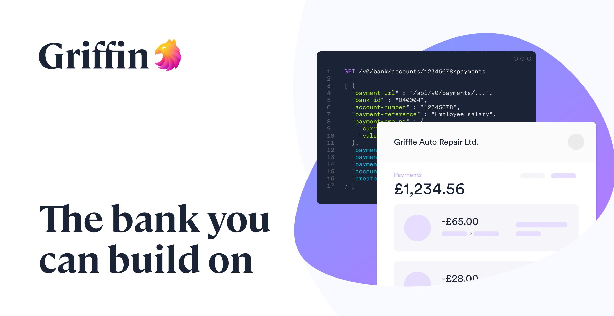

<div align="left">

[](https://griffin.com)

# [Griffin](https://griffin.com)<a id="griffin"></a>

## Introduction<a id="introduction"></a>

The Griffin API is based on [REST](https://en.wikipedia.org/wiki/Representational_state_transfer).
It has resource-oriented URLs, accepts [JSON](https://www.json.org/json-en.html)-encoded request bodies, returns [JSON](https://www.json.org/json-en.html)-encoded responses, and uses standard HTTP response verbs and response codes.

Our API deviates from strict RESTful principles if it makes sense to do so, such as when we enforce tighter access controls around certain operations.
For example, when closing a bank account: rather than send a PATCH request to the [bank account](http://docs.griffin.com) resource to update it's status to `"closed"`, we provide a dedicated account closure resource.

Anyone can [create an account](https://app.griffin.com/register) with Griffin and try out out API in [sandbox mode](http://docs.griffin.com).

New to Griffin? Check out our [getting started guide](http://docs.griffin.com).

## Navigation<a id="navigation"></a>

Our API is designed to be navigated programmatically. When you request any resource, you will find the URLs for related resources in the response body.

The API is structured as a tree with your [organization](http://docs.griffin.com) at the top. Everything that you own will be a sub-resource of your organization.

To bootstrap the navigation process, request the [index](http://docs.griffin.com) endpoint: the response will contain your `organization-url`.

For a walkthrough, see our [getting started guide](http://docs.griffin.com).

## Pagination<a id="pagination"></a>

Our list APIs support pagination (e.g. [list bank accounts](http://docs.griffin.com) and [list payments](http://docs.griffin.com)).
By default, a list API returns up to 25 results. If there are more results available, the response payload will include links to the previous/next pages.

### Change page size<a id="change-page-size"></a>

You can request a different number of results (between 1 and 200, inclusive) by using the `page[size]` query parameter:

```
GET /v0/organizations/:id/bank/accounts?page[size]=100
```

### Navigating between pages<a id="navigating-between-pages"></a>

List responses will include a `links` object with `prev` and `next` attributes, as shown below.
Perform a GET request to the value of the attribute to fetch the previous/next page of results.

```
{
  "accounts": [
    // ...
  ],
  "links": {
    "prev": "/v0/organizations/og.IG9yZ2FuaXphdGlvbi1pZA/bank/accounts?page[before]=djE6WxSPxfYUTnCU9XtWzj9gGA",
    "next": "/v0/organizations/og.IG9yZ2FuaXphdGlvbi1pZA/bank/accounts?page[after]=djE6aw79PXZySUOL16LD8HRJ3A"
  }
}

```
If there is no previous or next page available, the value of the attribute will be  null.

Any other query parameters included in the initial request will also be included in the response payload's links.
If you want to change parameters (see [filtering and sorting](http://docs.griffin.com)), request the first page and follow the links from there.

## Filtering and sorting<a id="filtering-and-sorting"></a>

### Sort results<a id="sort-results"></a>

By default, resources will be listed in descending order, usually based on the `created-at` attribute.
You can change the sorting behaviour of a list of results by using the `sort` query parameter.

For example, to list bank accounts in ascending order (oldest first):

```
GET /v0/organizations/:id/bank/accounts?sort=created-at
```

To _explicitly_ sort in descending order (newest first), prefix the sort attribute with `-`:

```
GET /v0/organizations/:id/bank/accounts?sort=-created-at
```

### Filter results<a id="filter-results"></a>

Some list APIs allow you to filter the results.
Filters are expressed as nested data structures encoded into query parameters.
For example, you can list bank accounts that are in either the `opening` or `open` state with:

```
GET /v0/organizations/:id/bank/accounts?filter[account-status][in][]=opening&filter[account-status][in][]=open
```

Similarly, you can list legal persons with a specific `application-status`:

```
GET /v0/organizations/:id/legal-persons?filter[application-status][eq]=accepted
```

### Include resources<a id="include-resources"></a>

Some list APIs allow you to include associated resources in the response, reducing the number of requests needed to fetch related data.
For instance, when listing bank accounts, you can include each bank account's beneficiary legal person by using the `include` query parameter:

```
GET /v0/organizations/:id/bank/accounts?include=beneficiary
```

The response returns the usual list of bank accounts, but it will also have an `included` object with a `legal-persons` attribute:

```
{
  "accounts": [
    // ...
  ],
  "links": {
    // ...
  }
  "included": {
    "legal-persons": [
      // ...
    ]
  }
}
```

Check the documentation for each list API to see all options for sorting and filtering

## Versioning<a id="versioning"></a>

The Griffin API is versioned via a prefix in the URL.
The current version is v0.
An example endpoint is: https://api.griffin.com/v0/index.

We will not break your integration with a particular version for as long as we support that version.
If we release a new version, you will have 12 months to upgrade to it.

</div>

## Table of Contents<a id="table-of-contents"></a>

<!-- toc -->

- [Installation](#installation)
- [Getting Started](#getting-started)
- [Reference](#reference)
  * [`griffin.apiKeys.createKey`](#griffinapikeyscreatekey)
  * [`griffin.apiKeys.getKeyDetails`](#griffinapikeysgetkeydetails)
  * [`griffin.apiKeys.listActiveKeys`](#griffinapikeyslistactivekeys)
  * [`griffin.apiKeys.listActiveKeys_0`](#griffinapikeyslistactivekeys_0)
  * [`griffin.apiKeys.removeApiKey`](#griffinapikeysremoveapikey)
  * [`griffin.bankAccounts.closeAccount`](#griffinbankaccountscloseaccount)
  * [`griffin.bankAccounts.createNewAccount`](#griffinbankaccountscreatenewaccount)
  * [`griffin.bankAccounts.getAccount`](#griffinbankaccountsgetaccount)
  * [`griffin.bankAccounts.list`](#griffinbankaccountslist)
  * [`griffin.bankAccounts.updateBankAccount`](#griffinbankaccountsupdatebankaccount)
  * [`griffin.claims.createNewClaim`](#griffinclaimscreatenewclaim)
  * [`griffin.claims.getAllClaims`](#griffinclaimsgetallclaims)
  * [`griffin.companiesHouse.getCompanyDetails`](#griffincompanieshousegetcompanydetails)
  * [`griffin.connectivity.checkConnection`](#griffinconnectivitycheckconnection)
  * [`griffin.decisions.createDecision`](#griffindecisionscreatedecision)
  * [`griffin.decisions.listForLegalPerson`](#griffindecisionslistforlegalperson)
  * [`griffin.events.getAllOrganizationEvents`](#griffineventsgetallorganizationevents)
  * [`griffin.events.getEvent`](#griffineventsgetevent)
  * [`griffin.invitations.sendEmail`](#griffininvitationssendemail)
  * [`griffin.legalPersonHistory.listEvents`](#griffinlegalpersonhistorylistevents)
  * [`griffin.legalPersons.createNewLegalPerson`](#griffinlegalpersonscreatenewlegalperson)
  * [`griffin.legalPersons.getLegalPerson`](#griffinlegalpersonsgetlegalperson)
  * [`griffin.legalPersons.listLegalPersons`](#griffinlegalpersonslistlegalpersons)
  * [`griffin.legalPersons.updateLegalPerson`](#griffinlegalpersonsupdatelegalperson)
  * [`griffin.memberships.getMembershipInfo`](#griffinmembershipsgetmembershipinfo)
  * [`griffin.memberships.listOrganizationMemberships`](#griffinmembershipslistorganizationmemberships)
  * [`griffin.memberships.listUserMemberships`](#griffinmembershipslistusermemberships)
  * [`griffin.memberships.removeMember`](#griffinmembershipsremovemember)
  * [`griffin.navigation.globalPathsFetch`](#griffinnavigationglobalpathsfetch)
  * [`griffin.organizations.getDetails`](#griffinorganizationsgetdetails)
  * [`griffin.payees.getDetails`](#griffinpayeesgetdetails)
  * [`griffin.payees.listLegalPersonPayees`](#griffinpayeeslistlegalpersonpayees)
  * [`griffin.payees.registerNewPayee`](#griffinpayeesregisternewpayee)
  * [`griffin.payees.updatePayee`](#griffinpayeesupdatepayee)
  * [`griffin.payments.createRequest`](#griffinpaymentscreaterequest)
  * [`griffin.payments.getAdmission`](#griffinpaymentsgetadmission)
  * [`griffin.payments.getBankAccountPayments`](#griffinpaymentsgetbankaccountpayments)
  * [`griffin.payments.getDetails`](#griffinpaymentsgetdetails)
  * [`griffin.payments.getSubmission`](#griffinpaymentsgetsubmission)
  * [`griffin.payments.listAdmissions`](#griffinpaymentslistadmissions)
  * [`griffin.payments.listBankAccountAdmissions`](#griffinpaymentslistbankaccountadmissions)
  * [`griffin.payments.listSubmissions`](#griffinpaymentslistsubmissions)
  * [`griffin.payments.listSubmissions_0`](#griffinpaymentslistsubmissions_0)
  * [`griffin.payments.submitPaymentSubmission`](#griffinpaymentssubmitpaymentsubmission)
  * [`griffin.pooledAccountMembership.listLegalPersons`](#griffinpooledaccountmembershiplistlegalpersons)
  * [`griffin.pooledAccountMembership.manageLegalPersons`](#griffinpooledaccountmembershipmanagelegalpersons)
  * [`griffin.relianceOnboarding.createApplication`](#griffinrelianceonboardingcreateapplication)
  * [`griffin.relianceOnboarding.getApplication`](#griffinrelianceonboardinggetapplication)
  * [`griffin.roles.assignMembershipRoles`](#griffinrolesassignmembershiproles)
  * [`griffin.roles.getMembershipRoles`](#griffinrolesgetmembershiproles)
  * [`griffin.roles.getRole`](#griffinrolesgetrole)
  * [`griffin.roles.listAllRoles`](#griffinroleslistallroles)
  * [`griffin.transactions.getTransactionById`](#griffintransactionsgettransactionbyid)
  * [`griffin.transactions.listBalanceChanges`](#griffintransactionslistbalancechanges)
  * [`griffin.users.getUserResource`](#griffinusersgetuserresource)
  * [`griffin.verifications.getVerification`](#griffinverificationsgetverification)
  * [`griffin.verifications.initiateVerification`](#griffinverificationsinitiateverification)
  * [`griffin.verifications.listForLegalPerson`](#griffinverificationslistforlegalperson)
  * [`griffin.webhooks.activateAction`](#griffinwebhooksactivateaction)
  * [`griffin.webhooks.createWebhook`](#griffinwebhookscreatewebhook)
  * [`griffin.webhooks.deactivateAction`](#griffinwebhooksdeactivateaction)
  * [`griffin.webhooks.deleteWebhook`](#griffinwebhooksdeletewebhook)
  * [`griffin.webhooks.getAll`](#griffinwebhooksgetall)
  * [`griffin.webhooks.getLatestTestStatus`](#griffinwebhooksgetlatestteststatus)
  * [`griffin.webhooks.getWebhook`](#griffinwebhooksgetwebhook)
  * [`griffin.webhooks.sendTestEvent`](#griffinwebhookssendtestevent)
  * [`griffin.webhooks.updateWebhook`](#griffinwebhooksupdatewebhook)
  * [`griffin.workflows.getWorkflow`](#griffinworkflowsgetworkflow)
  * [`griffin.workflows.listOrganizationWorkflows`](#griffinworkflowslistorganizationworkflows)

<!-- tocstop -->

## Installation<a id="installation"></a>
<div align="center">
  <a href="https://konfigthis.com/sdk-sign-up?company=Griffin&language=TypeScript">
    
  </a>
</div>

## Getting Started<a id="getting-started"></a>

```typescript
import { Griffin } from "griffin-typescript-sdk";

const griffin = new Griffin({
  // Defining the base path is optional and defaults to https://api.griffin.com
  // basePath: "https://api.griffin.com",
  apiKey: "API_KEY",
});

const createKeyResponse = await griffin.apiKeys.createKey({
  organizationId: "organizationId_example",
  api_key_name: null,
});

console.log(createKeyResponse);
```

## Reference<a id="reference"></a>


### `griffin.apiKeys.createKey`<a id="griffinapikeyscreatekey"></a>

Create a new API key. This is the only time `api-key-secret` is shown.

#### 🛠️ Usage<a id="🛠️-usage"></a>

```typescript
const createKeyResponse = await griffin.apiKeys.createKey({
  organizationId: "organizationId_example",
  api_key_name: null,
});
```

#### ⚙️ Parameters<a id="⚙️-parameters"></a>

##### api-key-name: `any`<a id="api-key-name-any"></a>

The name of the API Key. Cannot contain whitespace.

##### organizationId: `string`<a id="organizationid-string"></a>

#### 🔄 Return<a id="🔄-return"></a>

[ApiKeysCreateKeyResponse](./models/api-keys-create-key-response.ts)

#### 🌐 Endpoint<a id="🌐-endpoint"></a>

`/v0/organizations/{organization-id}/api-keys` `POST`

[🔙 **Back to Table of Contents**](#table-of-contents)

---


### `griffin.apiKeys.getKeyDetails`<a id="griffinapikeysgetkeydetails"></a>

Returns the API key without `api-key-secret`.

#### 🛠️ Usage<a id="🛠️-usage"></a>

```typescript
const getKeyDetailsResponse = await griffin.apiKeys.getKeyDetails({
  apiKeyId: "apiKeyId_example",
});
```

#### ⚙️ Parameters<a id="⚙️-parameters"></a>

##### apiKeyId: `string`<a id="apikeyid-string"></a>

#### 🔄 Return<a id="🔄-return"></a>

[ApiKeysGetKeyDetailsResponse](./models/api-keys-get-key-details-response.ts)

#### 🌐 Endpoint<a id="🌐-endpoint"></a>

`/v0/api-keys/{api-key-id}` `GET`

[🔙 **Back to Table of Contents**](#table-of-contents)

---


### `griffin.apiKeys.listActiveKeys`<a id="griffinapikeyslistactivekeys"></a>

List all active API keys in your organization.

#### 🛠️ Usage<a id="🛠️-usage"></a>

```typescript
const listActiveKeysResponse = await griffin.apiKeys.listActiveKeys({
  sort: "-created-at",
  organizationId: "organizationId_example",
});
```

#### ⚙️ Parameters<a id="⚙️-parameters"></a>

##### organizationId: `string`<a id="organizationid-string"></a>

##### sort: `'-created-at' | 'created-at'`<a id="sort--created-at--created-at"></a>


##### pageSize: `number`<a id="pagesize-number"></a>


##### pageAfter: `string`<a id="pageafter-string"></a>

A base64 encoded opaque string returned in paginated responses.

##### pageBefore: `string`<a id="pagebefore-string"></a>

A base64 encoded opaque string returned in paginated responses.

#### 🔄 Return<a id="🔄-return"></a>

[ApiKeysListActiveKeysResponse](./models/api-keys-list-active-keys-response.ts)

#### 🌐 Endpoint<a id="🌐-endpoint"></a>

`/v0/organizations/{organization-id}/api-keys` `GET`

[🔙 **Back to Table of Contents**](#table-of-contents)

---


### `griffin.apiKeys.listActiveKeys_0`<a id="griffinapikeyslistactivekeys_0"></a>

List all your active API keys.

#### 🛠️ Usage<a id="🛠️-usage"></a>

```typescript
const listActiveKeys_0Response = await griffin.apiKeys.listActiveKeys_0({
  sort: "-created-at",
  userId: "userId_example",
});
```

#### ⚙️ Parameters<a id="⚙️-parameters"></a>

##### userId: `string`<a id="userid-string"></a>

##### sort: `'-created-at' | 'created-at'`<a id="sort--created-at--created-at"></a>


##### pageSize: `number`<a id="pagesize-number"></a>


##### pageAfter: `string`<a id="pageafter-string"></a>

A base64 encoded opaque string returned in paginated responses.

##### pageBefore: `string`<a id="pagebefore-string"></a>

A base64 encoded opaque string returned in paginated responses.

#### 🔄 Return<a id="🔄-return"></a>

[ApiKeysListActiveKeys200Response](./models/api-keys-list-active-keys200-response.ts)

#### 🌐 Endpoint<a id="🌐-endpoint"></a>

`/v0/users/{user-id}/api-keys` `GET`

[🔙 **Back to Table of Contents**](#table-of-contents)

---


### `griffin.apiKeys.removeApiKey`<a id="griffinapikeysremoveapikey"></a>

Deletes the API Key. This operation cannot be undone.

#### 🛠️ Usage<a id="🛠️-usage"></a>

```typescript
const removeApiKeyResponse = await griffin.apiKeys.removeApiKey({
  apiKeyId: "apiKeyId_example",
});
```

#### ⚙️ Parameters<a id="⚙️-parameters"></a>

##### apiKeyId: `string`<a id="apikeyid-string"></a>

#### 🌐 Endpoint<a id="🌐-endpoint"></a>

`/v0/api-keys/{api-key-id}` `DELETE`

[🔙 **Back to Table of Contents**](#table-of-contents)

---


### `griffin.bankAccounts.closeAccount`<a id="griffinbankaccountscloseaccount"></a>

Close a bank account

#### 🛠️ Usage<a id="🛠️-usage"></a>

```typescript
const closeAccountResponse = await griffin.bankAccounts.closeAccount({
  bankAccountId: "bankAccountId_example",
});
```

#### ⚙️ Parameters<a id="⚙️-parameters"></a>

##### bankAccountId: `string`<a id="bankaccountid-string"></a>

#### 🔄 Return<a id="🔄-return"></a>

[BankAccountsCloseAccountResponse](./models/bank-accounts-close-account-response.ts)

#### 🌐 Endpoint<a id="🌐-endpoint"></a>

`/v0/bank/accounts/{bank-account-id}/actions/close` `POST`

[🔙 **Back to Table of Contents**](#table-of-contents)

---


### `griffin.bankAccounts.createNewAccount`<a id="griffinbankaccountscreatenewaccount"></a>

Open a new bank account

#### 🛠️ Usage<a id="🛠️-usage"></a>

```typescript
const createNewAccountResponse = await griffin.bankAccounts.createNewAccount({
  organizationId: "organizationId_example",
});
```

#### ⚙️ Parameters<a id="⚙️-parameters"></a>

##### bank-product-type: `string`<a id="bank-product-type-string"></a>

##### organizationId: `string`<a id="organizationid-string"></a>

##### owner-url: `string`<a id="owner-url-string"></a>

Link to the [legal person](http://docs.griffin.com) that represents the [owner](http://docs.griffin.com) of the account.

##### savings-type: `string`<a id="savings-type-string"></a>

Specifies the type of savings account.

##### display-name: `string`<a id="display-name-string"></a>

A human readable label for an entity

#### 🔄 Return<a id="🔄-return"></a>

[BankAccountsCreateNewAccountResponse](./models/bank-accounts-create-new-account-response.ts)

#### 🌐 Endpoint<a id="🌐-endpoint"></a>

`/v0/organizations/{organization-id}/bank/accounts` `POST`

[🔙 **Back to Table of Contents**](#table-of-contents)

---


### `griffin.bankAccounts.getAccount`<a id="griffinbankaccountsgetaccount"></a>

Fetch a bank account

#### 🛠️ Usage<a id="🛠️-usage"></a>

```typescript
const getAccountResponse = await griffin.bankAccounts.getAccount({
  bankAccountId: "bankAccountId_example",
});
```

#### ⚙️ Parameters<a id="⚙️-parameters"></a>

##### bankAccountId: `string`<a id="bankaccountid-string"></a>

#### 🔄 Return<a id="🔄-return"></a>

[BankAccountsGetAccountResponse](./models/bank-accounts-get-account-response.ts)

#### 🌐 Endpoint<a id="🌐-endpoint"></a>

`/v0/bank/accounts/{bank-account-id}` `GET`

[🔙 **Back to Table of Contents**](#table-of-contents)

---


### `griffin.bankAccounts.list`<a id="griffinbankaccountslist"></a>

Yields a list of all bank accounts under the control of this Organization.

#### 🛠️ Usage<a id="🛠️-usage"></a>

```typescript
const listResponse = await griffin.bankAccounts.list({
  sort: "-created-at",
  organizationId: "organizationId_example",
});
```

#### ⚙️ Parameters<a id="⚙️-parameters"></a>

##### organizationId: `string`<a id="organizationid-string"></a>

##### filterBeneficiaryEq: `string`<a id="filterbeneficiaryeq-string"></a>

Link to the [legal person](http://docs.griffin.com) that represents the [beneficiary](http://docs.griffin.com) of the account.

##### filterOwnerEq: `string`<a id="filterownereq-string"></a>

Link to the [legal person](http://docs.griffin.com) that represents the [owner](http://docs.griffin.com) of the account.

##### pageSize: `number`<a id="pagesize-number"></a>


##### include: `string`[]<a id="include-string"></a>

For each bank account returned, include its owner and/or beneficiary in the response under the `included.legal-persons` attribute.

##### filterAccountStatusIn: `string`[]<a id="filteraccountstatusin-string"></a>


##### sort: `'-created-at' | 'display-name' | 'created-at' | '-display-name'`<a id="sort--created-at--display-name--created-at---display-name"></a>


##### pageAfter: `string`<a id="pageafter-string"></a>

A base64 encoded opaque string returned in paginated responses.

##### filterAccountRestrictedIn: `boolean`<a id="filteraccountrestrictedin-boolean"></a>

Specifies whether the bank account has restrictions applied by Griffin.

##### filterPooledFundsEq: `boolean`<a id="filterpooledfundseq-boolean"></a>

Specifies whether the bank account holds funds belonging to multiple beneficiaries.

##### filterBankProductTypeIn: `string`[]<a id="filterbankproducttypein-string"></a>


##### pageBefore: `string`<a id="pagebefore-string"></a>

A base64 encoded opaque string returned in paginated responses.

#### 🔄 Return<a id="🔄-return"></a>

[BankAccountsListResponse](./models/bank-accounts-list-response.ts)

#### 🌐 Endpoint<a id="🌐-endpoint"></a>

`/v0/organizations/{organization-id}/bank/accounts` `GET`

[🔙 **Back to Table of Contents**](#table-of-contents)

---


### `griffin.bankAccounts.updateBankAccount`<a id="griffinbankaccountsupdatebankaccount"></a>

Update a bank account

#### 🛠️ Usage<a id="🛠️-usage"></a>

```typescript
const updateBankAccountResponse = await griffin.bankAccounts.updateBankAccount({
  bankAccountId: "bankAccountId_example",
  display_name: "display_name_example",
});
```

#### ⚙️ Parameters<a id="⚙️-parameters"></a>

##### display-name: `string`<a id="display-name-string"></a>

A human readable label for an entity

##### bankAccountId: `string`<a id="bankaccountid-string"></a>

#### 🔄 Return<a id="🔄-return"></a>

[BankAccountsUpdateBankAccountResponse](./models/bank-accounts-update-bank-account-response.ts)

#### 🌐 Endpoint<a id="🌐-endpoint"></a>

`/v0/bank/accounts/{bank-account-id}` `PATCH`

[🔙 **Back to Table of Contents**](#table-of-contents)

---


### `griffin.claims.createNewClaim`<a id="griffinclaimscreatenewclaim"></a>

Creates a new claim about a Legal Person.

#### 🛠️ Usage<a id="🛠️-usage"></a>

```typescript
const createNewClaimResponse = await griffin.claims.createNewClaim({
  legalPersonId: "legalPersonId_example",
});
```

#### ⚙️ Parameters<a id="⚙️-parameters"></a>

##### claim-type: `string`<a id="claim-type-string"></a>

##### legalPersonId: `string`<a id="legalpersonid-string"></a>

##### mobile-number: `any`<a id="mobile-number-any"></a>

##### date-of-birth: `string`<a id="date-of-birth-string"></a>

ISO 8601 formatted date.

##### given-name: `string`<a id="given-name-string"></a>

##### surname: `string`<a id="surname-string"></a>

##### middle-name: `string`<a id="middle-name-string"></a>

##### trading-name: `string`<a id="trading-name-string"></a>

##### trading-address: [`object`](./models/model-object.ts)<a id="trading-address-objectmodelsmodel-objectts"></a>

##### email-address: `any`<a id="email-address-any"></a>

##### city: `string`<a id="city-string"></a>

##### building-name: `string`<a id="building-name-string"></a>

##### street-name: `string`<a id="street-name-string"></a>

##### entity-name: `string`<a id="entity-name-string"></a>

##### postal-code: `string`<a id="postal-code-string"></a>

##### corporation-type: `string`<a id="corporation-type-string"></a>

##### telephone-number: `any`<a id="telephone-number-any"></a>

##### building-number: `string`<a id="building-number-string"></a>

##### country-code: `any`<a id="country-code-any"></a>

ISO 3166-1 alpha-2 two-letter country code.

##### date-of-incorporation: `string`<a id="date-of-incorporation-string"></a>

ISO 8601 formatted date.

##### entity-registration-number: `string`<a id="entity-registration-number-string"></a>

The entity number assigned by the local register. For UK companies that\\\'s the Companies House company number.

##### income: [`Income`](./models/income.ts)<a id="income-incomemodelsincomets"></a>

##### initial-deposit: [`InitialDeposit`](./models/initial-deposit.ts)<a id="initial-deposit-initialdepositmodelsinitial-depositts"></a>

##### international-payments-countries: `any`<a id="international-payments-countries-any"></a>
                                        `any`[]

##### legal-person-url: `string`<a id="legal-person-url-string"></a>

A contextual link to the [legal person](http://docs.griffin.com).

##### ownership-percent: `string`<a id="ownership-percent-string"></a>

The percentage ownership the legal person has of the corporation.

##### companies-house-url: `string`<a id="companies-house-url-string"></a>

The URL of the entity in Companies House

##### senior-manager?: `boolean`<a id="senior-manager-boolean"></a>

##### tax-residency: `any`<a id="tax-residency-any"></a>

ISO 3166-1 alpha-2 two-letter country code.

##### uk-regulatory-permissions: `string`[]<a id="uk-regulatory-permissions-string"></a>

##### business-description: `string`<a id="business-description-string"></a>

##### individual-sources-of-funds: `string`[]<a id="individual-sources-of-funds-string"></a>

##### business-address: [`object`](./models/model-object.ts)<a id="business-address-objectmodelsmodel-objectts"></a>

##### annual-turnover: [`AnnualTurnover`](./models/annual-turnover.ts)<a id="annual-turnover-annualturnovermodelsannual-turnoverts"></a>

##### purposes-of-account: `string`[]<a id="purposes-of-account-string"></a>

##### sic-codes: `string`[]<a id="sic-codes-string"></a>

##### international-operations-countries: `any`<a id="international-operations-countries-any"></a>
                                          `any`[]

##### sources-of-funds: `string`[]<a id="sources-of-funds-string"></a>

##### reliance-verification-methods: `string`[]<a id="reliance-verification-methods-string"></a>

##### reliance-verification-standard: `string`<a id="reliance-verification-standard-string"></a>

##### business-name: `string`<a id="business-name-string"></a>

##### individual-purposes-of-account: `string`[]<a id="individual-purposes-of-account-string"></a>

##### nationality: `any`<a id="nationality-any"></a>

ISO 3166-1 alpha-2 two-letter country code.

##### social-media: `string`<a id="social-media-string"></a>

##### website-url: `string`<a id="website-url-string"></a>

##### tax-identification-number: `string`<a id="tax-identification-number-string"></a>

#### 🔄 Return<a id="🔄-return"></a>

[ClaimsCreateNewClaimResponse](./models/claims-create-new-claim-response.ts)

#### 🌐 Endpoint<a id="🌐-endpoint"></a>

`/v0/legal-persons/{legal-person-id}/claims` `POST`

[🔙 **Back to Table of Contents**](#table-of-contents)

---


### `griffin.claims.getAllClaims`<a id="griffinclaimsgetallclaims"></a>

Yields a list of all current claims about this Legal Person.

#### 🛠️ Usage<a id="🛠️-usage"></a>

```typescript
const getAllClaimsResponse = await griffin.claims.getAllClaims({
  sort: "-created-at",
  legalPersonId: "legalPersonId_example",
});
```

#### ⚙️ Parameters<a id="⚙️-parameters"></a>

##### legalPersonId: `string`<a id="legalpersonid-string"></a>

##### sort: `'-created-at' | 'created-at'`<a id="sort--created-at--created-at"></a>


##### pageSize: `number`<a id="pagesize-number"></a>


##### pageAfter: `string`<a id="pageafter-string"></a>

A base64 encoded opaque string returned in paginated responses.

##### pageBefore: `string`<a id="pagebefore-string"></a>

A base64 encoded opaque string returned in paginated responses.

#### 🔄 Return<a id="🔄-return"></a>

[ClaimsGetAllClaimsResponse](./models/claims-get-all-claims-response.ts)

#### 🌐 Endpoint<a id="🌐-endpoint"></a>

`/v0/legal-persons/{legal-person-id}/claims` `GET`

[🔙 **Back to Table of Contents**](#table-of-contents)

---


### `griffin.companiesHouse.getCompanyDetails`<a id="griffincompanieshousegetcompanydetails"></a>

Lookup Companies House company by company number. Includes information about the company, its directors, and persons with significant control.

#### 🛠️ Usage<a id="🛠️-usage"></a>

```typescript
const getCompanyDetailsResponse =
  await griffin.companiesHouse.getCompanyDetails({
    companyNumber: "companyNumber_example",
  });
```

#### ⚙️ Parameters<a id="⚙️-parameters"></a>

##### companyNumber: `string`<a id="companynumber-string"></a>

UK Companies House company number

#### 🔄 Return<a id="🔄-return"></a>

[CompaniesHouseGetCompanyDetailsResponse](./models/companies-house-get-company-details-response.ts)

#### 🌐 Endpoint<a id="🌐-endpoint"></a>

`/v0/companies-house/companies/{company-number}` `GET`

[🔙 **Back to Table of Contents**](#table-of-contents)

---


### `griffin.connectivity.checkConnection`<a id="griffinconnectivitycheckconnection"></a>

Check your connection to the Griffin API.

#### 🛠️ Usage<a id="🛠️-usage"></a>

```typescript
const checkConnectionResponse = await griffin.connectivity.checkConnection();
```

#### 🌐 Endpoint<a id="🌐-endpoint"></a>

`/v0/ping` `GET`

[🔙 **Back to Table of Contents**](#table-of-contents)

---


### `griffin.decisions.createDecision`<a id="griffindecisionscreatedecision"></a>

Creates a decision against the legal person.

The provided verification must have a `verification-status` of `checks-complete`, otherwise a 422 is served.

When a decision is successfully created, the legal person's `application-status` is updated accordingly.

Multiple decisions may be made against the same legal person.

#### 🛠️ Usage<a id="🛠️-usage"></a>

```typescript
const createDecisionResponse = await griffin.decisions.createDecision({
  legalPersonId: "legalPersonId_example",
  verification_url: "/v0/verifications/vn.IHZlcmlmaWNhdGlvbi1pZA",
  decision_outcome: "accepted",
  decision_notes: "decision_notes_example",
});
```

#### ⚙️ Parameters<a id="⚙️-parameters"></a>

##### verification-url: `string`<a id="verification-url-string"></a>

A link to the [verification](http://docs.griffin.com).

##### decision-outcome: `string`<a id="decision-outcome-string"></a>

##### decision-notes: `string`<a id="decision-notes-string"></a>

Free-text field to explain the reasons behind the decision.

##### legalPersonId: `string`<a id="legalpersonid-string"></a>

#### 🔄 Return<a id="🔄-return"></a>

[DecisionsCreateDecisionResponse](./models/decisions-create-decision-response.ts)

#### 🌐 Endpoint<a id="🌐-endpoint"></a>

`/v0/legal-persons/{legal-person-id}/decisions` `POST`

[🔙 **Back to Table of Contents**](#table-of-contents)

---


### `griffin.decisions.listForLegalPerson`<a id="griffindecisionslistforlegalperson"></a>

Lists all decisions for the given legal-person.

#### 🛠️ Usage<a id="🛠️-usage"></a>

```typescript
const listForLegalPersonResponse = await griffin.decisions.listForLegalPerson({
  sort: "-created-at",
  legalPersonId: "legalPersonId_example",
});
```

#### ⚙️ Parameters<a id="⚙️-parameters"></a>

##### legalPersonId: `string`<a id="legalpersonid-string"></a>

##### sort: `'-created-at' | 'created-at'`<a id="sort--created-at--created-at"></a>


##### pageSize: `number`<a id="pagesize-number"></a>


##### pageAfter: `string`<a id="pageafter-string"></a>

A base64 encoded opaque string returned in paginated responses.

##### pageBefore: `string`<a id="pagebefore-string"></a>

A base64 encoded opaque string returned in paginated responses.

#### 🔄 Return<a id="🔄-return"></a>

[DecisionsListForLegalPersonResponse](./models/decisions-list-for-legal-person-response.ts)

#### 🌐 Endpoint<a id="🌐-endpoint"></a>

`/v0/legal-persons/{legal-person-id}/decisions` `GET`

[🔙 **Back to Table of Contents**](#table-of-contents)

---


### `griffin.events.getAllOrganizationEvents`<a id="griffineventsgetallorganizationevents"></a>

List all events for an organization

#### 🛠️ Usage<a id="🛠️-usage"></a>

```typescript
const getAllOrganizationEventsResponse =
  await griffin.events.getAllOrganizationEvents({
    sort: "-created-at",
    filterEventTypeEq: "decision-created",
    organizationId: "organizationId_example",
  });
```

#### ⚙️ Parameters<a id="⚙️-parameters"></a>

##### organizationId: `string`<a id="organizationid-string"></a>

##### sort: `'-created-at' | 'created-at'`<a id="sort--created-at--created-at"></a>


##### pageSize: `number`<a id="pagesize-number"></a>


##### pageBefore: `string`<a id="pagebefore-string"></a>

A base64 encoded opaque string returned in paginated responses.

##### pageAfter: `string`<a id="pageafter-string"></a>

A base64 encoded opaque string returned in paginated responses.

##### filterEventTypeEq: `'decision-created' | 'payment-created' | 'transaction-created' | 'verification-updated' | 'admission-updated' | 'verification-created' | 'account-status-updated' | 'submission-created' | 'test-event' | 'admission-created' | 'account-status-created' | 'submission-updated'`<a id="filtereventtypeeq-decision-created--payment-created--transaction-created--verification-updated--admission-updated--verification-created--account-status-updated--submission-created--test-event--admission-created--account-status-created--submission-updated"></a>

The type of webhook event. Usually has the form {resource}-{operation}, e.g. payment-updated

##### filterCreatedAtLte: `string`<a id="filtercreatedatlte-string"></a>

Return only events with a created-at less than or equal to the given timestamp.

##### filterCreatedAtLt: `string`<a id="filtercreatedatlt-string"></a>

Return only events with a created-at less than the given timestamp.

##### filterCreatedAtGte: `string`<a id="filtercreatedatgte-string"></a>

Return only events with a created-at greater than or equal to the given timestamp.

##### filterCreatedAtGt: `string`<a id="filtercreatedatgt-string"></a>

Return only events with a created-at greater than the given timestamp.

#### 🔄 Return<a id="🔄-return"></a>

[EventsGetAllOrganizationEventsResponse](./models/events-get-all-organization-events-response.ts)

#### 🌐 Endpoint<a id="🌐-endpoint"></a>

`/v0/organizations/{organization-id}/events` `GET`

[🔙 **Back to Table of Contents**](#table-of-contents)

---


### `griffin.events.getEvent`<a id="griffineventsgetevent"></a>

Get an event

#### 🛠️ Usage<a id="🛠️-usage"></a>

```typescript
const getEventResponse = await griffin.events.getEvent({
  eventId: "eventId_example",
});
```

#### ⚙️ Parameters<a id="⚙️-parameters"></a>

##### eventId: `string`<a id="eventid-string"></a>

#### 🔄 Return<a id="🔄-return"></a>

[EventsGetEventResponse](./models/events-get-event-response.ts)

#### 🌐 Endpoint<a id="🌐-endpoint"></a>

`/v0/events/{event-id}` `GET`

[🔙 **Back to Table of Contents**](#table-of-contents)

---


### `griffin.invitations.sendEmail`<a id="griffininvitationssendemail"></a>

`POST` creates a new invitation to the organization.

Sends an email invitation to join the `organization` to the specified `email-address`.

#### 🛠️ Usage<a id="🛠️-usage"></a>

```typescript
const sendEmailResponse = await griffin.invitations.sendEmail({
  organizationId: "organizationId_example",
  email_address: null,
});
```

#### ⚙️ Parameters<a id="⚙️-parameters"></a>

##### email-address: `any`<a id="email-address-any"></a>

##### organizationId: `string`<a id="organizationid-string"></a>

#### 🌐 Endpoint<a id="🌐-endpoint"></a>

`/v0/organizations/{organization-id}/invitations` `POST`

[🔙 **Back to Table of Contents**](#table-of-contents)

---


### `griffin.legalPersonHistory.listEvents`<a id="griffinlegalpersonhistorylistevents"></a>

Lists history of events for the given legal person.

#### 🛠️ Usage<a id="🛠️-usage"></a>

```typescript
const listEventsResponse = await griffin.legalPersonHistory.listEvents({
  legalPersonId: "legalPersonId_example",
});
```

#### ⚙️ Parameters<a id="⚙️-parameters"></a>

##### legalPersonId: `string`<a id="legalpersonid-string"></a>

##### pageSize: `number`<a id="pagesize-number"></a>


##### pageAfter: `string`<a id="pageafter-string"></a>

A base64 encoded opaque string returned in paginated responses.

##### pageBefore: `string`<a id="pagebefore-string"></a>

A base64 encoded opaque string returned in paginated responses.

#### 🔄 Return<a id="🔄-return"></a>

[LegalPersonHistoryListEventsResponse](./models/legal-person-history-list-events-response.ts)

#### 🌐 Endpoint<a id="🌐-endpoint"></a>

`/v0/legal-persons/{legal-person-id}/history` `GET`

[🔙 **Back to Table of Contents**](#table-of-contents)

---


### `griffin.legalPersons.createNewLegalPerson`<a id="griffinlegalpersonscreatenewlegalperson"></a>

Creates a new Legal Person. A collection of [Claims](http://docs.griffin.com) may be provided.

#### 🛠️ Usage<a id="🛠️-usage"></a>

```typescript
const createNewLegalPersonResponse =
  await griffin.legalPersons.createNewLegalPerson({
    organizationId: "organizationId_example",
    display_name: "display_name_example",
    legal_person_type: "individual",
  });
```

#### ⚙️ Parameters<a id="⚙️-parameters"></a>

##### display-name: `string`<a id="display-name-string"></a>

A human readable label for an entity

##### legal-person-type: `string`<a id="legal-person-type-string"></a>

Specifies if the legal person is an `individual` or a `corporation`.

##### organizationId: `string`<a id="organizationid-string"></a>

##### claims: [`Claim`](./models/claim.ts)[]<a id="claims-claimmodelsclaimts"></a>

#### 🔄 Return<a id="🔄-return"></a>

[LegalPersonsCreateNewLegalPersonResponse](./models/legal-persons-create-new-legal-person-response.ts)

#### 🌐 Endpoint<a id="🌐-endpoint"></a>

`/v0/organizations/{organization-id}/legal-persons` `POST`

[🔙 **Back to Table of Contents**](#table-of-contents)

---


### `griffin.legalPersons.getLegalPerson`<a id="griffinlegalpersonsgetlegalperson"></a>

Yields the legal-person.

#### 🛠️ Usage<a id="🛠️-usage"></a>

```typescript
const getLegalPersonResponse = await griffin.legalPersons.getLegalPerson({
  legalPersonId: "legalPersonId_example",
});
```

#### ⚙️ Parameters<a id="⚙️-parameters"></a>

##### legalPersonId: `string`<a id="legalpersonid-string"></a>

#### 🔄 Return<a id="🔄-return"></a>

[LegalPersonsGetLegalPersonResponse](./models/legal-persons-get-legal-person-response.ts)

#### 🌐 Endpoint<a id="🌐-endpoint"></a>

`/v0/legal-persons/{legal-person-id}` `GET`

[🔙 **Back to Table of Contents**](#table-of-contents)

---


### `griffin.legalPersons.listLegalPersons`<a id="griffinlegalpersonslistlegalpersons"></a>

Returns a paginated list of all legal persons for the given organization.

By default, results are sorted descending by `created-at` (newest first). To sort ascending by `created-at`, provide a `?sort=created-at` query parameter. 

#### 🛠️ Usage<a id="🛠️-usage"></a>

```typescript
const listLegalPersonsResponse = await griffin.legalPersons.listLegalPersons({
  sort: "-status-changed-at",
  filterApplicationStatusEq: "referred",
  organizationId: "organizationId_example",
});
```

#### ⚙️ Parameters<a id="⚙️-parameters"></a>

##### organizationId: `string`<a id="organizationid-string"></a>

##### sort: `'-status-changed-at' | 'status-changed-at' | '-created-at' | 'created-at'`<a id="sort--status-changed-at--status-changed-at---created-at--created-at"></a>


##### include: `string`[]<a id="include-string"></a>

For each legal person returned, include its latest verification (if one exists), and/or its latest risk rating (if one exists) in the response under the `included` attribute.

##### filterApplicationStatusEq: `'referred' | 'errored' | 'declined' | 'submitted' | 'accepted'`<a id="filterapplicationstatuseq-referred--errored--declined--submitted--accepted"></a>

Return only legal persons with the given application-status.

##### filterHas: `string`[]<a id="filterhas-string"></a>

Return only legal persons with the given attributes.

##### pageSize: `number`<a id="pagesize-number"></a>


##### pageAfter: `string`<a id="pageafter-string"></a>

A base64 encoded opaque string returned in paginated responses.

##### pageBefore: `string`<a id="pagebefore-string"></a>

A base64 encoded opaque string returned in paginated responses.

#### 🔄 Return<a id="🔄-return"></a>

[LegalPersonsListLegalPersonsResponse](./models/legal-persons-list-legal-persons-response.ts)

#### 🌐 Endpoint<a id="🌐-endpoint"></a>

`/v0/organizations/{organization-id}/legal-persons` `GET`

[🔙 **Back to Table of Contents**](#table-of-contents)

---


### `griffin.legalPersons.updateLegalPerson`<a id="griffinlegalpersonsupdatelegalperson"></a>

Updates the legal-person.

#### 🛠️ Usage<a id="🛠️-usage"></a>

```typescript
const updateLegalPersonResponse = await griffin.legalPersons.updateLegalPerson({
  legalPersonId: "legalPersonId_example",
  display_name: "display_name_example",
});
```

#### ⚙️ Parameters<a id="⚙️-parameters"></a>

##### display-name: `string`<a id="display-name-string"></a>

A human readable label for an entity

##### legalPersonId: `string`<a id="legalpersonid-string"></a>

#### 🔄 Return<a id="🔄-return"></a>

[LegalPersonsUpdateLegalPersonResponse](./models/legal-persons-update-legal-person-response.ts)

#### 🌐 Endpoint<a id="🌐-endpoint"></a>

`/v0/legal-persons/{legal-person-id}` `PUT`

[🔙 **Back to Table of Contents**](#table-of-contents)

---


### `griffin.memberships.getMembershipInfo`<a id="griffinmembershipsgetmembershipinfo"></a>

Returns the [user's](http://docs.griffin.com) [membership](http://docs.griffin.com) information.

#### 🛠️ Usage<a id="🛠️-usage"></a>

```typescript
const getMembershipInfoResponse = await griffin.memberships.getMembershipInfo({
  membershipId: "membershipId_example",
});
```

#### ⚙️ Parameters<a id="⚙️-parameters"></a>

##### membershipId: `string`<a id="membershipid-string"></a>

#### 🔄 Return<a id="🔄-return"></a>

[MembershipsGetMembershipInfoResponse](./models/memberships-get-membership-info-response.ts)

#### 🌐 Endpoint<a id="🌐-endpoint"></a>

`/v0/memberships/{membership-id}` `GET`

[🔙 **Back to Table of Contents**](#table-of-contents)

---


### `griffin.memberships.listOrganizationMemberships`<a id="griffinmembershipslistorganizationmemberships"></a>

Returns this [organization's](http://docs.griffin.com) [memberships](http://docs.griffin.com).

#### 🛠️ Usage<a id="🛠️-usage"></a>

```typescript
const listOrganizationMembershipsResponse =
  await griffin.memberships.listOrganizationMemberships({
    sort: "-created-at",
    organizationId: "organizationId_example",
  });
```

#### ⚙️ Parameters<a id="⚙️-parameters"></a>

##### organizationId: `string`<a id="organizationid-string"></a>

##### sort: `'-created-at' | 'created-at'`<a id="sort--created-at--created-at"></a>


##### pageSize: `number`<a id="pagesize-number"></a>


##### pageAfter: `string`<a id="pageafter-string"></a>

A base64 encoded opaque string returned in paginated responses.

##### pageBefore: `string`<a id="pagebefore-string"></a>

A base64 encoded opaque string returned in paginated responses.

#### 🔄 Return<a id="🔄-return"></a>

[MembershipsListOrganizationMembershipsResponse](./models/memberships-list-organization-memberships-response.ts)

#### 🌐 Endpoint<a id="🌐-endpoint"></a>

`/v0/organizations/{organization-id}/memberships` `GET`

[🔙 **Back to Table of Contents**](#table-of-contents)

---


### `griffin.memberships.listUserMemberships`<a id="griffinmembershipslistusermemberships"></a>

Returns this [user's](http://docs.griffin.com) [memberships](http://docs.griffin.com).

#### 🛠️ Usage<a id="🛠️-usage"></a>

```typescript
const listUserMembershipsResponse =
  await griffin.memberships.listUserMemberships({
    sort: "-created-at",
    userId: "userId_example",
  });
```

#### ⚙️ Parameters<a id="⚙️-parameters"></a>

##### userId: `string`<a id="userid-string"></a>

##### sort: `'-created-at' | 'created-at'`<a id="sort--created-at--created-at"></a>


##### pageSize: `number`<a id="pagesize-number"></a>


##### pageAfter: `string`<a id="pageafter-string"></a>

A base64 encoded opaque string returned in paginated responses.

##### pageBefore: `string`<a id="pagebefore-string"></a>

A base64 encoded opaque string returned in paginated responses.

#### 🔄 Return<a id="🔄-return"></a>

[MembershipsListUserMembershipsResponse](./models/memberships-list-user-memberships-response.ts)

#### 🌐 Endpoint<a id="🌐-endpoint"></a>

`/v0/users/{user-id}/memberships` `GET`

[🔙 **Back to Table of Contents**](#table-of-contents)

---


### `griffin.memberships.removeMember`<a id="griffinmembershipsremovemember"></a>

Removes a [user](http://docs.griffin.com) from an [organization](http://docs.griffin.com).

#### 🛠️ Usage<a id="🛠️-usage"></a>

```typescript
const removeMemberResponse = await griffin.memberships.removeMember({
  membershipId: "membershipId_example",
});
```

#### ⚙️ Parameters<a id="⚙️-parameters"></a>

##### membershipId: `string`<a id="membershipid-string"></a>

#### 🌐 Endpoint<a id="🌐-endpoint"></a>

`/v0/memberships/{membership-id}` `DELETE`

[🔙 **Back to Table of Contents**](#table-of-contents)

---


### `griffin.navigation.globalPathsFetch`<a id="griffinnavigationglobalpathsfetch"></a>

Contains various global URL paths. Follow `api-key-url` to discover your `organization-url`.

#### 🛠️ Usage<a id="🛠️-usage"></a>

```typescript
const globalPathsFetchResponse = await griffin.navigation.globalPathsFetch();
```

#### 🔄 Return<a id="🔄-return"></a>

[NavigationGlobalPathsFetchResponse](./models/navigation-global-paths-fetch-response.ts)

#### 🌐 Endpoint<a id="🌐-endpoint"></a>

`/v0/index` `GET`

[🔙 **Back to Table of Contents**](#table-of-contents)

---


### `griffin.organizations.getDetails`<a id="griffinorganizationsgetdetails"></a>

Yields the organization details

#### 🛠️ Usage<a id="🛠️-usage"></a>

```typescript
const getDetailsResponse = await griffin.organizations.getDetails({
  organizationId: "organizationId_example",
});
```

#### ⚙️ Parameters<a id="⚙️-parameters"></a>

##### organizationId: `string`<a id="organizationid-string"></a>

#### 🔄 Return<a id="🔄-return"></a>

[OrganizationsGetDetailsResponse](./models/organizations-get-details-response.ts)

#### 🌐 Endpoint<a id="🌐-endpoint"></a>

`/v0/organizations/{organization-id}` `GET`

[🔙 **Back to Table of Contents**](#table-of-contents)

---


### `griffin.payees.getDetails`<a id="griffinpayeesgetdetails"></a>

Yields payee details

#### 🛠️ Usage<a id="🛠️-usage"></a>

```typescript
const getDetailsResponse = await griffin.payees.getDetails({
  payeeId: "payeeId_example",
});
```

#### ⚙️ Parameters<a id="⚙️-parameters"></a>

##### payeeId: `string`<a id="payeeid-string"></a>

#### 🔄 Return<a id="🔄-return"></a>

[PayeesGetDetailsResponse](./models/payees-get-details-response.ts)

#### 🌐 Endpoint<a id="🌐-endpoint"></a>

`/v0/payees/{payee-id}` `GET`

[🔙 **Back to Table of Contents**](#table-of-contents)

---


### `griffin.payees.listLegalPersonPayees`<a id="griffinpayeeslistlegalpersonpayees"></a>

Lists payees belonging to the legal person.

#### 🛠️ Usage<a id="🛠️-usage"></a>

```typescript
const listLegalPersonPayeesResponse =
  await griffin.payees.listLegalPersonPayees({
    sort: "-created-at",
    legalPersonId: "legalPersonId_example",
  });
```

#### ⚙️ Parameters<a id="⚙️-parameters"></a>

##### legalPersonId: `string`<a id="legalpersonid-string"></a>

##### sort: `'-created-at' | 'created-at'`<a id="sort--created-at--created-at"></a>


##### pageSize: `number`<a id="pagesize-number"></a>


##### pageAfter: `string`<a id="pageafter-string"></a>

A base64 encoded opaque string returned in paginated responses.

##### pageBefore: `string`<a id="pagebefore-string"></a>

A base64 encoded opaque string returned in paginated responses.

#### 🔄 Return<a id="🔄-return"></a>

[PayeesListLegalPersonPayeesResponse](./models/payees-list-legal-person-payees-response.ts)

#### 🌐 Endpoint<a id="🌐-endpoint"></a>

`/v0/legal-persons/{legal-person-id}/bank/payees` `GET`

[🔙 **Back to Table of Contents**](#table-of-contents)

---


### `griffin.payees.registerNewPayee`<a id="griffinpayeesregisternewpayee"></a>

Registers a new payee for the customer

#### 🛠️ Usage<a id="🛠️-usage"></a>

```typescript
const registerNewPayeeResponse = await griffin.payees.registerNewPayee({
  legalPersonId: "legalPersonId_example",
  account_holder: "account_holder_example",
  account_number: "12345678",
  bank_id: "123456",
});
```

#### ⚙️ Parameters<a id="⚙️-parameters"></a>

##### account-holder: `string`<a id="account-holder-string"></a>

The name of the [account holder](http://docs.griffin.com).

##### account-number: `string`<a id="account-number-string"></a>

Must be a UK BBAN.

##### bank-id: `string`<a id="bank-id-string"></a>

Must be a UK Sort Code.

##### legalPersonId: `string`<a id="legalpersonid-string"></a>

#### 🔄 Return<a id="🔄-return"></a>

[PayeesRegisterNewPayeeResponse](./models/payees-register-new-payee-response.ts)

#### 🌐 Endpoint<a id="🌐-endpoint"></a>

`/v0/legal-persons/{legal-person-id}/bank/payees` `POST`

[🔙 **Back to Table of Contents**](#table-of-contents)

---


### `griffin.payees.updatePayee`<a id="griffinpayeesupdatepayee"></a>

Updates an existing payee.

A payee can be deactivated by updating the `payee-status` of an active payee to `deactivated`. Any attempt to create or submit a payment to a deactivated payee will fail.

A 422 is served when attempting to deactivate an already-deactivated payee.

#### 🛠️ Usage<a id="🛠️-usage"></a>

```typescript
const updatePayeeResponse = await griffin.payees.updatePayee({
  payeeId: "payeeId_example",
  payee_status: "deactivated",
});
```

#### ⚙️ Parameters<a id="⚙️-parameters"></a>

##### payee-status: `string`<a id="payee-status-string"></a>

##### payeeId: `string`<a id="payeeid-string"></a>

#### 🔄 Return<a id="🔄-return"></a>

[PayeesUpdatePayeeResponse](./models/payees-update-payee-response.ts)

#### 🌐 Endpoint<a id="🌐-endpoint"></a>

`/v0/payees/{payee-id}` `PATCH`

[🔙 **Back to Table of Contents**](#table-of-contents)

---


### `griffin.payments.createRequest`<a id="griffinpaymentscreaterequest"></a>

Registers a new payment request for the bank account

#### 🛠️ Usage<a id="🛠️-usage"></a>

```typescript
const createRequestResponse = await griffin.payments.createRequest({
  bankAccountId: "bankAccountId_example",
  creditor: {},
  payment_amount: {
    currency: "GBP",
    value: "1000.00",
  },
  payment_reference: "test reference",
});
```

#### ⚙️ Parameters<a id="⚙️-parameters"></a>

##### creditor: [`CreditorProperty`](./models/creditor-property.ts)<a id="creditor-creditorpropertymodelscreditor-propertyts"></a>

##### payment-amount: [`PaymentAmountProperty`](./models/payment-amount-property.ts)<a id="payment-amount-paymentamountpropertymodelspayment-amount-propertyts"></a>

##### bankAccountId: `string`<a id="bankaccountid-string"></a>

##### payment-reference: `string`<a id="payment-reference-string"></a>

Free-text field to help identify and categorise payments.

#### 🔄 Return<a id="🔄-return"></a>

[PaymentsCreateRequestResponse](./models/payments-create-request-response.ts)

#### 🌐 Endpoint<a id="🌐-endpoint"></a>

`/v0/bank/accounts/{bank-account-id}/payments` `POST`

[🔙 **Back to Table of Contents**](#table-of-contents)

---


### `griffin.payments.getAdmission`<a id="griffinpaymentsgetadmission"></a>

Yields an admission.

#### 🛠️ Usage<a id="🛠️-usage"></a>

```typescript
const getAdmissionResponse = await griffin.payments.getAdmission({
  admissionId: "admissionId_example",
});
```

#### ⚙️ Parameters<a id="⚙️-parameters"></a>

##### admissionId: `string`<a id="admissionid-string"></a>

#### 🔄 Return<a id="🔄-return"></a>

[PaymentsGetAdmissionResponse](./models/payments-get-admission-response.ts)

#### 🌐 Endpoint<a id="🌐-endpoint"></a>

`/v0/admissions/{admission-id}` `GET`

[🔙 **Back to Table of Contents**](#table-of-contents)

---


### `griffin.payments.getBankAccountPayments`<a id="griffinpaymentsgetbankaccountpayments"></a>

Lists payments made from a bank account.

#### 🛠️ Usage<a id="🛠️-usage"></a>

```typescript
const getBankAccountPaymentsResponse =
  await griffin.payments.getBankAccountPayments({
    sort: "-created-at",
    bankAccountId: "bankAccountId_example",
  });
```

#### ⚙️ Parameters<a id="⚙️-parameters"></a>

##### bankAccountId: `string`<a id="bankaccountid-string"></a>

##### sort: `'-created-at' | 'created-at'`<a id="sort--created-at--created-at"></a>


##### pageSize: `number`<a id="pagesize-number"></a>


##### pageBefore: `string`<a id="pagebefore-string"></a>

A base64 encoded opaque string returned in paginated responses.

##### pageAfter: `string`<a id="pageafter-string"></a>

A base64 encoded opaque string returned in paginated responses.

##### filterCreatedAtLte: `string`<a id="filtercreatedatlte-string"></a>

Return only resources with a created-at less than or equal to the given timestamp.

##### filterCreatedAtLt: `string`<a id="filtercreatedatlt-string"></a>

Return only resources with a created-at less than the given timestamp.

##### filterCreatedAtGte: `string`<a id="filtercreatedatgte-string"></a>

Return only resources with a created-at greater than or equal to the given timestamp.

##### filterCreatedAtGt: `string`<a id="filtercreatedatgt-string"></a>

Return only resources with a created-at greater than the given timestamp.

#### 🔄 Return<a id="🔄-return"></a>

[PaymentsGetBankAccountPaymentsResponse](./models/payments-get-bank-account-payments-response.ts)

#### 🌐 Endpoint<a id="🌐-endpoint"></a>

`/v0/bank/accounts/{bank-account-id}/payments` `GET`

[🔙 **Back to Table of Contents**](#table-of-contents)

---


### `griffin.payments.getDetails`<a id="griffinpaymentsgetdetails"></a>

Yields payment details

#### 🛠️ Usage<a id="🛠️-usage"></a>

```typescript
const getDetailsResponse = await griffin.payments.getDetails({
  paymentId: "paymentId_example",
});
```

#### ⚙️ Parameters<a id="⚙️-parameters"></a>

##### paymentId: `string`<a id="paymentid-string"></a>

#### 🔄 Return<a id="🔄-return"></a>

[PaymentsGetDetailsResponse](./models/payments-get-details-response.ts)

#### 🌐 Endpoint<a id="🌐-endpoint"></a>

`/v0/payments/{payment-id}` `GET`

[🔙 **Back to Table of Contents**](#table-of-contents)

---


### `griffin.payments.getSubmission`<a id="griffinpaymentsgetsubmission"></a>

Yields a submission.

#### 🛠️ Usage<a id="🛠️-usage"></a>

```typescript
const getSubmissionResponse = await griffin.payments.getSubmission({
  submissionId: "submissionId_example",
});
```

#### ⚙️ Parameters<a id="⚙️-parameters"></a>

##### submissionId: `string`<a id="submissionid-string"></a>

#### 🔄 Return<a id="🔄-return"></a>

[PaymentsGetSubmissionResponse](./models/payments-get-submission-response.ts)

#### 🌐 Endpoint<a id="🌐-endpoint"></a>

`/v0/submissions/{submission-id}` `GET`

[🔙 **Back to Table of Contents**](#table-of-contents)

---


### `griffin.payments.listAdmissions`<a id="griffinpaymentslistadmissions"></a>

Lists admissions for a payment. A payment may have at most one admission.

#### 🛠️ Usage<a id="🛠️-usage"></a>

```typescript
const listAdmissionsResponse = await griffin.payments.listAdmissions({
  paymentId: "paymentId_example",
});
```

#### ⚙️ Parameters<a id="⚙️-parameters"></a>

##### paymentId: `string`<a id="paymentid-string"></a>

#### 🔄 Return<a id="🔄-return"></a>

[PaymentsListAdmissionsResponse](./models/payments-list-admissions-response.ts)

#### 🌐 Endpoint<a id="🌐-endpoint"></a>

`/v0/payments/{payment-id}/admissions` `GET`

[🔙 **Back to Table of Contents**](#table-of-contents)

---


### `griffin.payments.listBankAccountAdmissions`<a id="griffinpaymentslistbankaccountadmissions"></a>

Lists admissions targeting a bank account

#### 🛠️ Usage<a id="🛠️-usage"></a>

```typescript
const listBankAccountAdmissionsResponse =
  await griffin.payments.listBankAccountAdmissions({
    sort: "-created-at",
    bankAccountId: "bankAccountId_example",
  });
```

#### ⚙️ Parameters<a id="⚙️-parameters"></a>

##### bankAccountId: `string`<a id="bankaccountid-string"></a>

##### sort: `'-created-at' | 'created-at'`<a id="sort--created-at--created-at"></a>


##### pageSize: `number`<a id="pagesize-number"></a>


##### pageBefore: `string`<a id="pagebefore-string"></a>

A base64 encoded opaque string returned in paginated responses.

##### pageAfter: `string`<a id="pageafter-string"></a>

A base64 encoded opaque string returned in paginated responses.

##### filterCreatedAtLte: `string`<a id="filtercreatedatlte-string"></a>

Return only resources with a created-at less than or equal to the given timestamp.

##### filterCreatedAtLt: `string`<a id="filtercreatedatlt-string"></a>

Return only resources with a created-at less than the given timestamp.

##### filterCreatedAtGte: `string`<a id="filtercreatedatgte-string"></a>

Return only resources with a created-at greater than or equal to the given timestamp.

##### filterCreatedAtGt: `string`<a id="filtercreatedatgt-string"></a>

Return only resources with a created-at greater than the given timestamp.

##### filterAdmissionStatusIn: `string`[]<a id="filteradmissionstatusin-string"></a>


#### 🔄 Return<a id="🔄-return"></a>

[PaymentsListBankAccountAdmissionsResponse](./models/payments-list-bank-account-admissions-response.ts)

#### 🌐 Endpoint<a id="🌐-endpoint"></a>

`/v0/bank/accounts/{bank-account-id}/admissions` `GET`

[🔙 **Back to Table of Contents**](#table-of-contents)

---


### `griffin.payments.listSubmissions`<a id="griffinpaymentslistsubmissions"></a>

Lists submissions originating from a bank account

#### 🛠️ Usage<a id="🛠️-usage"></a>

```typescript
const listSubmissionsResponse = await griffin.payments.listSubmissions({
  sort: "-created-at",
  bankAccountId: "bankAccountId_example",
});
```

#### ⚙️ Parameters<a id="⚙️-parameters"></a>

##### bankAccountId: `string`<a id="bankaccountid-string"></a>

##### sort: `'-created-at' | 'created-at'`<a id="sort--created-at--created-at"></a>


##### pageSize: `number`<a id="pagesize-number"></a>


##### pageBefore: `string`<a id="pagebefore-string"></a>

A base64 encoded opaque string returned in paginated responses.

##### pageAfter: `string`<a id="pageafter-string"></a>

A base64 encoded opaque string returned in paginated responses.

##### filterSubmissionStatusIn: `string`[]<a id="filtersubmissionstatusin-string"></a>


##### filterCreatedAtLte: `string`<a id="filtercreatedatlte-string"></a>

Return only resources with a created-at less than or equal to the given timestamp.

##### filterCreatedAtLt: `string`<a id="filtercreatedatlt-string"></a>

Return only resources with a created-at less than the given timestamp.

##### filterCreatedAtGte: `string`<a id="filtercreatedatgte-string"></a>

Return only resources with a created-at greater than or equal to the given timestamp.

##### filterCreatedAtGt: `string`<a id="filtercreatedatgt-string"></a>

Return only resources with a created-at greater than the given timestamp.

#### 🔄 Return<a id="🔄-return"></a>

[PaymentsListSubmissionsResponse](./models/payments-list-submissions-response.ts)

#### 🌐 Endpoint<a id="🌐-endpoint"></a>

`/v0/bank/accounts/{bank-account-id}/submissions` `GET`

[🔙 **Back to Table of Contents**](#table-of-contents)

---


### `griffin.payments.listSubmissions_0`<a id="griffinpaymentslistsubmissions_0"></a>

Lists submissions for a payment. The presence of a submission means that the payment has been submitted.

#### 🛠️ Usage<a id="🛠️-usage"></a>

```typescript
const listSubmissions_0Response = await griffin.payments.listSubmissions_0({
  paymentId: "paymentId_example",
});
```

#### ⚙️ Parameters<a id="⚙️-parameters"></a>

##### paymentId: `string`<a id="paymentid-string"></a>

#### 🔄 Return<a id="🔄-return"></a>

[PaymentsListSubmissions200Response](./models/payments-list-submissions200-response.ts)

#### 🌐 Endpoint<a id="🌐-endpoint"></a>

`/v0/payments/{payment-id}/submissions` `GET`

[🔙 **Back to Table of Contents**](#table-of-contents)

---


### `griffin.payments.submitPaymentSubmission`<a id="griffinpaymentssubmitpaymentsubmission"></a>

Submits a previously created payment for execution.

#### 🛠️ Usage<a id="🛠️-usage"></a>

```typescript
const submitPaymentSubmissionResponse =
  await griffin.payments.submitPaymentSubmission({
    paymentId: "paymentId_example",
    payment_scheme: "fps",
  });
```

#### ⚙️ Parameters<a id="⚙️-parameters"></a>

##### paymentId: `string`<a id="paymentid-string"></a>

##### payment-scheme: `string`<a id="payment-scheme-string"></a>

Specifies the scheme over which a payment is executed.

#### 🔄 Return<a id="🔄-return"></a>

[PaymentsSubmitPaymentSubmissionResponse](./models/payments-submit-payment-submission-response.ts)

#### 🌐 Endpoint<a id="🌐-endpoint"></a>

`/v0/payments/{payment-id}/submissions` `POST`

[🔙 **Back to Table of Contents**](#table-of-contents)

---


### `griffin.pooledAccountMembership.listLegalPersons`<a id="griffinpooledaccountmembershiplistlegalpersons"></a>

List legal persons in a pooled account membership

#### 🛠️ Usage<a id="🛠️-usage"></a>

```typescript
const listLegalPersonsResponse =
  await griffin.pooledAccountMembership.listLegalPersons({
    bankAccountId: "bankAccountId_example",
  });
```

#### ⚙️ Parameters<a id="⚙️-parameters"></a>

##### bankAccountId: `string`<a id="bankaccountid-string"></a>

##### include: `string`[]<a id="include-string"></a>

For each member returned, include its legal person details, latest verification (if one exists), and/or latest risk rating (if one exists) in the response under the `included` attribute.

##### pageSize: `number`<a id="pagesize-number"></a>


##### pageAfter: `string`<a id="pageafter-string"></a>

A base64 encoded opaque string returned in paginated responses.

##### pageBefore: `string`<a id="pagebefore-string"></a>

A base64 encoded opaque string returned in paginated responses.

#### 🔄 Return<a id="🔄-return"></a>

[PooledAccountMembershipListLegalPersonsResponse](./models/pooled-account-membership-list-legal-persons-response.ts)

#### 🌐 Endpoint<a id="🌐-endpoint"></a>

`/v0/bank/accounts/{bank-account-id}/membership` `GET`

[🔙 **Back to Table of Contents**](#table-of-contents)

---


### `griffin.pooledAccountMembership.manageLegalPersons`<a id="griffinpooledaccountmembershipmanagelegalpersons"></a>

Add and update the legal persons in a pooled account membership. Limited to 2000 legal persons per operation.

#### 🛠️ Usage<a id="🛠️-usage"></a>

```typescript
const manageLegalPersonsResponse =
  await griffin.pooledAccountMembership.manageLegalPersons({
    bankAccountId: "bankAccountId_example",
    additions: ["/v0/legal-persons/lp.IGxlZ2FsLXBlcnNvbi1pZA"],
    deletions: ["/v0/legal-persons/lp.IGxlZ2FsLXBlcnNvbi1pZA"],
  });
```

#### ⚙️ Parameters<a id="⚙️-parameters"></a>

##### additions: `string`[]<a id="additions-string"></a>

##### deletions: `string`[]<a id="deletions-string"></a>

##### bankAccountId: `string`<a id="bankaccountid-string"></a>

#### 🔄 Return<a id="🔄-return"></a>

[PooledAccountMembershipManageLegalPersonsResponse](./models/pooled-account-membership-manage-legal-persons-response.ts)

#### 🌐 Endpoint<a id="🌐-endpoint"></a>

`/v0/bank/accounts/{bank-account-id}/membership-updates` `POST`

[🔙 **Back to Table of Contents**](#table-of-contents)

---


### `griffin.relianceOnboarding.createApplication`<a id="griffinrelianceonboardingcreateapplication"></a>

Create an onboarding application and submit it for processing.

#### 🛠️ Usage<a id="🛠️-usage"></a>

```typescript
const createApplicationResponse =
  await griffin.relianceOnboarding.createApplication({
    organizationId: "organizationId_example",
    workflow_url: "/v0/workflows/wf.ICAgICB3b3JrZmxvdy1pZA",
    subject_profile: {
      display_name: "display_name_example",
      claims: [{}],
    },
  });
```

#### ⚙️ Parameters<a id="⚙️-parameters"></a>

##### workflow-url: `string`<a id="workflow-url-string"></a>

A link to the [workflow](http://docs.griffin.com).

##### subject-profile: [`SubjectProfileProperty`](./models/subject-profile-property.ts)<a id="subject-profile-subjectprofilepropertymodelssubject-profile-propertyts"></a>

##### organizationId: `string`<a id="organizationid-string"></a>

##### related-profiles: [`RelatedProfile`](./models/related-profile.ts)[]<a id="related-profiles-relatedprofilemodelsrelated-profilets"></a>

A list profiles related to the subject (e.g. directors, person with significant control).

#### 🔄 Return<a id="🔄-return"></a>

[RelianceOnboardingCreateApplicationResponse](./models/reliance-onboarding-create-application-response.ts)

#### 🌐 Endpoint<a id="🌐-endpoint"></a>

`/v0/organizations/{organization-id}/onboarding/applications` `POST`

[🔙 **Back to Table of Contents**](#table-of-contents)

---


### `griffin.relianceOnboarding.getApplication`<a id="griffinrelianceonboardinggetapplication"></a>

Fetch an onboarding application.

#### 🛠️ Usage<a id="🛠️-usage"></a>

```typescript
const getApplicationResponse = await griffin.relianceOnboarding.getApplication({
  onboardingApplicationId: "onboardingApplicationId_example",
});
```

#### ⚙️ Parameters<a id="⚙️-parameters"></a>

##### onboardingApplicationId: `string`<a id="onboardingapplicationid-string"></a>

#### 🔄 Return<a id="🔄-return"></a>

[RelianceOnboardingGetApplicationResponse](./models/reliance-onboarding-get-application-response.ts)

#### 🌐 Endpoint<a id="🌐-endpoint"></a>

`/v0/onboarding/applications/{onboarding-application-id}` `GET`

[🔙 **Back to Table of Contents**](#table-of-contents)

---


### `griffin.roles.assignMembershipRoles`<a id="griffinrolesassignmembershiproles"></a>

Assigns [roles](http://docs.griffin.com) to the [membership](http://docs.griffin.com).

A 422 is served if you provide a role that is not in the [Organisations](http://docs.griffin.com) `"available-roles"`.

#### 🛠️ Usage<a id="🛠️-usage"></a>

```typescript
const assignMembershipRolesResponse = await griffin.roles.assignMembershipRoles(
  {
    membershipId: "membershipId_example",
    role_urls: ["/v0/roles/re.ICAgICAgICAgcm9sZS1pZA"],
  }
);
```

#### ⚙️ Parameters<a id="⚙️-parameters"></a>

##### role-urls: `string`[]<a id="role-urls-string"></a>

##### membershipId: `string`<a id="membershipid-string"></a>

#### 🔄 Return<a id="🔄-return"></a>

[RolesAssignMembershipRolesResponse](./models/roles-assign-membership-roles-response.ts)

#### 🌐 Endpoint<a id="🌐-endpoint"></a>

`/v0/memberships/{membership-id}/roles` `PUT`

[🔙 **Back to Table of Contents**](#table-of-contents)

---


### `griffin.roles.getMembershipRoles`<a id="griffinrolesgetmembershiproles"></a>

Returns the [roles](http://docs.griffin.com) assigned to this [membership](http://docs.griffin.com).

#### 🛠️ Usage<a id="🛠️-usage"></a>

```typescript
const getMembershipRolesResponse = await griffin.roles.getMembershipRoles({
  membershipId: "membershipId_example",
});
```

#### ⚙️ Parameters<a id="⚙️-parameters"></a>

##### membershipId: `string`<a id="membershipid-string"></a>

#### 🔄 Return<a id="🔄-return"></a>

[RolesGetMembershipRolesResponse](./models/roles-get-membership-roles-response.ts)

#### 🌐 Endpoint<a id="🌐-endpoint"></a>

`/v0/memberships/{membership-id}/roles` `GET`

[🔙 **Back to Table of Contents**](#table-of-contents)

---


### `griffin.roles.getRole`<a id="griffinrolesgetrole"></a>

Yields the Role resource.

#### 🛠️ Usage<a id="🛠️-usage"></a>

```typescript
const getRoleResponse = await griffin.roles.getRole({
  roleId: "roleId_example",
});
```

#### ⚙️ Parameters<a id="⚙️-parameters"></a>

##### roleId: `string`<a id="roleid-string"></a>

#### 🔄 Return<a id="🔄-return"></a>

[RolesGetRoleResponse](./models/roles-get-role-response.ts)

#### 🌐 Endpoint<a id="🌐-endpoint"></a>

`/v0/roles/{role-id}` `GET`

[🔙 **Back to Table of Contents**](#table-of-contents)

---


### `griffin.roles.listAllRoles`<a id="griffinroleslistallroles"></a>

Yields a list of all Role resources.

#### 🛠️ Usage<a id="🛠️-usage"></a>

```typescript
const listAllRolesResponse = await griffin.roles.listAllRoles();
```

#### 🔄 Return<a id="🔄-return"></a>

[RolesListAllRolesResponse](./models/roles-list-all-roles-response.ts)

#### 🌐 Endpoint<a id="🌐-endpoint"></a>

`/v0/roles` `GET`

[🔙 **Back to Table of Contents**](#table-of-contents)

---


### `griffin.transactions.getTransactionById`<a id="griffintransactionsgettransactionbyid"></a>

Yields a bank account transaction

#### 🛠️ Usage<a id="🛠️-usage"></a>

```typescript
const getTransactionByIdResponse =
  await griffin.transactions.getTransactionById({
    transactionId: "transactionId_example",
  });
```

#### ⚙️ Parameters<a id="⚙️-parameters"></a>

##### transactionId: `string`<a id="transactionid-string"></a>

#### 🔄 Return<a id="🔄-return"></a>

[TransactionsGetTransactionByIdResponse](./models/transactions-get-transaction-by-id-response.ts)

#### 🌐 Endpoint<a id="🌐-endpoint"></a>

`/v0/bank/transactions/{transaction-id}` `GET`

[🔙 **Back to Table of Contents**](#table-of-contents)

---


### `griffin.transactions.listBalanceChanges`<a id="griffintransactionslistbalancechanges"></a>

Lists balance changes on a bank account.

#### 🛠️ Usage<a id="🛠️-usage"></a>

```typescript
const listBalanceChangesResponse =
  await griffin.transactions.listBalanceChanges({
    sort: "-created-at",
    include: "payment",
    bankAccountId: "bankAccountId_example",
  });
```

#### ⚙️ Parameters<a id="⚙️-parameters"></a>

##### bankAccountId: `string`<a id="bankaccountid-string"></a>

##### sort: `'-created-at' | 'created-at'`<a id="sort--created-at--created-at"></a>


##### pageSize: `number`<a id="pagesize-number"></a>


##### pageBefore: `string`<a id="pagebefore-string"></a>

A base64 encoded opaque string returned in paginated responses.

##### pageAfter: `string`<a id="pageafter-string"></a>

A base64 encoded opaque string returned in paginated responses.

##### include: `'payment'`<a id="include-payment"></a>

For each transaction returned, include its payment (if one exists) in the response under the `included` attribute.

##### filterPostDatetimeLte: `string`<a id="filterpostdatetimelte-string"></a>

Return only resources with a created-at less than or equal to the given timestamp.

##### filterPostDatetimeLt: `string`<a id="filterpostdatetimelt-string"></a>

Return only resources with a created-at less than the given timestamp.

##### filterPostDatetimeGte: `string`<a id="filterpostdatetimegte-string"></a>

Return only resources with a created-at greater than or equal to the given timestamp.

##### filterPostDatetimeGt: `string`<a id="filterpostdatetimegt-string"></a>

Return only resources with a created-at greater than the given timestamp.

#### 🔄 Return<a id="🔄-return"></a>

[TransactionsListBalanceChangesResponse](./models/transactions-list-balance-changes-response.ts)

#### 🌐 Endpoint<a id="🌐-endpoint"></a>

`/v0/bank/accounts/{bank-account-id}/transactions` `GET`

[🔙 **Back to Table of Contents**](#table-of-contents)

---


### `griffin.users.getUserResource`<a id="griffinusersgetuserresource"></a>

Get the User resource for the current user.

#### 🛠️ Usage<a id="🛠️-usage"></a>

```typescript
const getUserResourceResponse = await griffin.users.getUserResource({
  userId: "userId_example",
});
```

#### ⚙️ Parameters<a id="⚙️-parameters"></a>

##### userId: `string`<a id="userid-string"></a>

#### 🔄 Return<a id="🔄-return"></a>

[UsersGetUserResourceResponse](./models/users-get-user-resource-response.ts)

#### 🌐 Endpoint<a id="🌐-endpoint"></a>

`/v0/users/{user-id}` `GET`

[🔙 **Back to Table of Contents**](#table-of-contents)

---


### `griffin.verifications.getVerification`<a id="griffinverificationsgetverification"></a>

Fetch the verification.

#### 🛠️ Usage<a id="🛠️-usage"></a>

```typescript
const getVerificationResponse = await griffin.verifications.getVerification({
  verificationId: "verificationId_example",
});
```

#### ⚙️ Parameters<a id="⚙️-parameters"></a>

##### verificationId: `string`<a id="verificationid-string"></a>

#### 🔄 Return<a id="🔄-return"></a>

[VerificationsGetVerificationResponse](./models/verifications-get-verification-response.ts)

#### 🌐 Endpoint<a id="🌐-endpoint"></a>

`/v0/verifications/{verification-id}` `GET`

[🔙 **Back to Table of Contents**](#table-of-contents)

---


### `griffin.verifications.initiateVerification`<a id="griffinverificationsinitiateverification"></a>

Initiates verification of the subject legal person.

The request body must include a `workflow-url` to determine checks to be
performed by the verification. The workflow specified determines which claims
must exist for the subject legal person, as identified in the request URL, and any
associated legal persons (i.e. directors and people with significant control of a
corporation).

These claims can be found in the `required-claim-types` field on a [Workflow](http://docs.griffin.com).

---

Once a verification is created, the system will perform checks on the claim details.
The status of check processing is indicated by the `verification-status` in the response body.
Initially it will be `pending`, and will transition through `in-progress` to a final status of `checks-complete`.

A `verification-status` of `failed` indicates something went wrong during check processing.
You can initiate another verification to retry the check processing.

#### 🛠️ Usage<a id="🛠️-usage"></a>

```typescript
const initiateVerificationResponse =
  await griffin.verifications.initiateVerification({
    legalPersonId: "legalPersonId_example",
    workflow_url: "/v0/workflows/wf.ICAgICB3b3JrZmxvdy1pZA",
  });
```

#### ⚙️ Parameters<a id="⚙️-parameters"></a>

##### workflow-url: `string`<a id="workflow-url-string"></a>

A link to the [workflow](http://docs.griffin.com).

##### legalPersonId: `string`<a id="legalpersonid-string"></a>

#### 🔄 Return<a id="🔄-return"></a>

[VerificationsInitiateVerificationResponse](./models/verifications-initiate-verification-response.ts)

#### 🌐 Endpoint<a id="🌐-endpoint"></a>

`/v0/legal-persons/{legal-person-id}/verifications` `POST`

[🔙 **Back to Table of Contents**](#table-of-contents)

---


### `griffin.verifications.listForLegalPerson`<a id="griffinverificationslistforlegalperson"></a>

List verifications for the given legal person.

#### 🛠️ Usage<a id="🛠️-usage"></a>

```typescript
const listForLegalPersonResponse =
  await griffin.verifications.listForLegalPerson({
    sort: "-created-at",
    legalPersonId: "legalPersonId_example",
  });
```

#### ⚙️ Parameters<a id="⚙️-parameters"></a>

##### legalPersonId: `string`<a id="legalpersonid-string"></a>

##### sort: `'-created-at' | 'created-at'`<a id="sort--created-at--created-at"></a>


##### pageSize: `number`<a id="pagesize-number"></a>


##### pageAfter: `string`<a id="pageafter-string"></a>

A base64 encoded opaque string returned in paginated responses.

##### pageBefore: `string`<a id="pagebefore-string"></a>

A base64 encoded opaque string returned in paginated responses.

#### 🔄 Return<a id="🔄-return"></a>

[VerificationsListForLegalPersonResponse](./models/verifications-list-for-legal-person-response.ts)

#### 🌐 Endpoint<a id="🌐-endpoint"></a>

`/v0/legal-persons/{legal-person-id}/verifications` `GET`

[🔙 **Back to Table of Contents**](#table-of-contents)

---


### `griffin.webhooks.activateAction`<a id="griffinwebhooksactivateaction"></a>

Activate a webhook

#### 🛠️ Usage<a id="🛠️-usage"></a>

```typescript
const activateActionResponse = await griffin.webhooks.activateAction({
  webhookId: "webhookId_example",
});
```

#### ⚙️ Parameters<a id="⚙️-parameters"></a>

##### webhookId: `string`<a id="webhookid-string"></a>

#### 🔄 Return<a id="🔄-return"></a>

[WebhooksActivateActionResponse](./models/webhooks-activate-action-response.ts)

#### 🌐 Endpoint<a id="🌐-endpoint"></a>

`/v0/webhooks/{webhook-id}/actions/activate` `POST`

[🔙 **Back to Table of Contents**](#table-of-contents)

---


### `griffin.webhooks.createWebhook`<a id="griffinwebhookscreatewebhook"></a>

Create a webhook

#### 🛠️ Usage<a id="🛠️-usage"></a>

```typescript
const createWebhookResponse = await griffin.webhooks.createWebhook({
  organizationId: "organizationId_example",
  webhook_destination_url: "https://example.com/griffin/webhook/",
  webhook_description: "Griffin API webhook",
});
```

#### ⚙️ Parameters<a id="⚙️-parameters"></a>

##### webhook-destination-url: `string`<a id="webhook-destination-url-string"></a>

The callback URL of the webhook

##### organizationId: `string`<a id="organizationid-string"></a>

##### webhook-description: `string`<a id="webhook-description-string"></a>

A description of the webhook

#### 🔄 Return<a id="🔄-return"></a>

[WebhooksCreateWebhookResponse](./models/webhooks-create-webhook-response.ts)

#### 🌐 Endpoint<a id="🌐-endpoint"></a>

`/v0/organizations/{organization-id}/webhooks` `POST`

[🔙 **Back to Table of Contents**](#table-of-contents)

---


### `griffin.webhooks.deactivateAction`<a id="griffinwebhooksdeactivateaction"></a>

Deactivate a webhook

#### 🛠️ Usage<a id="🛠️-usage"></a>

```typescript
const deactivateActionResponse = await griffin.webhooks.deactivateAction({
  webhookId: "webhookId_example",
});
```

#### ⚙️ Parameters<a id="⚙️-parameters"></a>

##### webhookId: `string`<a id="webhookid-string"></a>

#### 🔄 Return<a id="🔄-return"></a>

[WebhooksDeactivateActionResponse](./models/webhooks-deactivate-action-response.ts)

#### 🌐 Endpoint<a id="🌐-endpoint"></a>

`/v0/webhooks/{webhook-id}/actions/deactivate` `POST`

[🔙 **Back to Table of Contents**](#table-of-contents)

---


### `griffin.webhooks.deleteWebhook`<a id="griffinwebhooksdeletewebhook"></a>

Delete a webhook

#### 🛠️ Usage<a id="🛠️-usage"></a>

```typescript
const deleteWebhookResponse = await griffin.webhooks.deleteWebhook({
  webhookId: "webhookId_example",
});
```

#### ⚙️ Parameters<a id="⚙️-parameters"></a>

##### webhookId: `string`<a id="webhookid-string"></a>

#### 🌐 Endpoint<a id="🌐-endpoint"></a>

`/v0/webhooks/{webhook-id}` `DELETE`

[🔙 **Back to Table of Contents**](#table-of-contents)

---


### `griffin.webhooks.getAll`<a id="griffinwebhooksgetall"></a>

Get all webhooks for the organization

#### 🛠️ Usage<a id="🛠️-usage"></a>

```typescript
const getAllResponse = await griffin.webhooks.getAll({
  organizationId: "organizationId_example",
});
```

#### ⚙️ Parameters<a id="⚙️-parameters"></a>

##### organizationId: `string`<a id="organizationid-string"></a>

#### 🔄 Return<a id="🔄-return"></a>

[WebhooksGetAllResponse](./models/webhooks-get-all-response.ts)

#### 🌐 Endpoint<a id="🌐-endpoint"></a>

`/v0/organizations/{organization-id}/webhooks` `GET`

[🔙 **Back to Table of Contents**](#table-of-contents)

---


### `griffin.webhooks.getLatestTestStatus`<a id="griffinwebhooksgetlatestteststatus"></a>

Get the status of the latest test event

#### 🛠️ Usage<a id="🛠️-usage"></a>

```typescript
const getLatestTestStatusResponse = await griffin.webhooks.getLatestTestStatus({
  webhookId: "webhookId_example",
});
```

#### ⚙️ Parameters<a id="⚙️-parameters"></a>

##### webhookId: `string`<a id="webhookid-string"></a>

#### 🔄 Return<a id="🔄-return"></a>

[WebhooksGetLatestTestStatusResponse](./models/webhooks-get-latest-test-status-response.ts)

#### 🌐 Endpoint<a id="🌐-endpoint"></a>

`/v0/webhooks/{webhook-id}/actions/test` `GET`

[🔙 **Back to Table of Contents**](#table-of-contents)

---


### `griffin.webhooks.getWebhook`<a id="griffinwebhooksgetwebhook"></a>

Fetch a webhook

#### 🛠️ Usage<a id="🛠️-usage"></a>

```typescript
const getWebhookResponse = await griffin.webhooks.getWebhook({
  webhookId: "webhookId_example",
});
```

#### ⚙️ Parameters<a id="⚙️-parameters"></a>

##### webhookId: `string`<a id="webhookid-string"></a>

#### 🔄 Return<a id="🔄-return"></a>

[WebhooksGetWebhookResponse](./models/webhooks-get-webhook-response.ts)

#### 🌐 Endpoint<a id="🌐-endpoint"></a>

`/v0/webhooks/{webhook-id}` `GET`

[🔙 **Back to Table of Contents**](#table-of-contents)

---


### `griffin.webhooks.sendTestEvent`<a id="griffinwebhookssendtestevent"></a>

Send a test event to the webhook

#### 🛠️ Usage<a id="🛠️-usage"></a>

```typescript
const sendTestEventResponse = await griffin.webhooks.sendTestEvent({
  webhookId: "webhookId_example",
});
```

#### ⚙️ Parameters<a id="⚙️-parameters"></a>

##### webhookId: `string`<a id="webhookid-string"></a>

#### 🔄 Return<a id="🔄-return"></a>

[WebhooksSendTestEventResponse](./models/webhooks-send-test-event-response.ts)

#### 🌐 Endpoint<a id="🌐-endpoint"></a>

`/v0/webhooks/{webhook-id}/actions/test` `POST`

[🔙 **Back to Table of Contents**](#table-of-contents)

---


### `griffin.webhooks.updateWebhook`<a id="griffinwebhooksupdatewebhook"></a>

Update a webhook

#### 🛠️ Usage<a id="🛠️-usage"></a>

```typescript
const updateWebhookResponse = await griffin.webhooks.updateWebhook({
  webhookId: "webhookId_example",
  webhook_description: "Griffin API webhook",
});
```

#### ⚙️ Parameters<a id="⚙️-parameters"></a>

##### webhookId: `string`<a id="webhookid-string"></a>

##### webhook-description: `string`<a id="webhook-description-string"></a>

A description of the webhook

#### 🔄 Return<a id="🔄-return"></a>

[WebhooksUpdateWebhookResponse](./models/webhooks-update-webhook-response.ts)

#### 🌐 Endpoint<a id="🌐-endpoint"></a>

`/v0/webhooks/{webhook-id}` `PATCH`

[🔙 **Back to Table of Contents**](#table-of-contents)

---


### `griffin.workflows.getWorkflow`<a id="griffinworkflowsgetworkflow"></a>

Fetch the workflow.

#### 🛠️ Usage<a id="🛠️-usage"></a>

```typescript
const getWorkflowResponse = await griffin.workflows.getWorkflow({
  workflowId: "workflowId_example",
});
```

#### ⚙️ Parameters<a id="⚙️-parameters"></a>

##### workflowId: `string`<a id="workflowid-string"></a>

#### 🔄 Return<a id="🔄-return"></a>

[WorkflowsGetWorkflowResponse](./models/workflows-get-workflow-response.ts)

#### 🌐 Endpoint<a id="🌐-endpoint"></a>

`/v0/workflows/{workflow-id}` `GET`

[🔙 **Back to Table of Contents**](#table-of-contents)

---


### `griffin.workflows.listOrganizationWorkflows`<a id="griffinworkflowslistorganizationworkflows"></a>

Lists workflows for use when creating a [verification](http://docs.griffin.com).

#### 🛠️ Usage<a id="🛠️-usage"></a>

```typescript
const listOrganizationWorkflowsResponse =
  await griffin.workflows.listOrganizationWorkflows({
    sort: "-created-at",
    organizationId: "organizationId_example",
  });
```

#### ⚙️ Parameters<a id="⚙️-parameters"></a>

##### organizationId: `string`<a id="organizationid-string"></a>

##### sort: `'-created-at' | 'created-at'`<a id="sort--created-at--created-at"></a>


##### pageSize: `number`<a id="pagesize-number"></a>


##### pageAfter: `string`<a id="pageafter-string"></a>

A base64 encoded opaque string returned in paginated responses.

##### pageBefore: `string`<a id="pagebefore-string"></a>

A base64 encoded opaque string returned in paginated responses.

#### 🔄 Return<a id="🔄-return"></a>

[WorkflowsListOrganizationWorkflowsResponse](./models/workflows-list-organization-workflows-response.ts)

#### 🌐 Endpoint<a id="🌐-endpoint"></a>

`/v0/organizations/{organization-id}/workflows` `GET`

[🔙 **Back to Table of Contents**](#table-of-contents)

---


## Author<a id="author"></a>
This TypeScript package is automatically generated by [Konfig](https://konfigthis.com)
